# Assignment 3

Building Recurrent Neural Networks. </br>
Types of RNN cells: </br>
- RNN
- LSTM
- GRU
- mLSTM
- mGRU

## Requirements
[requirements.txt](./requirements.txt) has all the required libraries. </br>
`pip install -r requirements.txt`


## Data Generation
`Vocabulary = ['a','x','c','r','y','w','b','t','o']` </br>
`delimiter character = '$', unknown character = ' '` </br>

sample input:  </br>
```
['b', 'r', 't', 'y', 'b', 'c', 'b', 't', 'y', 'r', 't', 't', 'c',
       'w', 'y', 'x', 't', 'w', 'x', 'y', 'a', 'w', 'o', 'a', 'c', 'b',
       'r', 'o', 'c', 'y', 'c', 'b', 'y', 'o', 'b', 'x', 'r', 'o', 'x',
       'o', 'y', 'x', 'r', 'b', 't', 'c', 'a', 'r', 'x', 't', 'r', 'x',
       'w', 'w', 'r', 'w', 'x', 'x', 'r', 't', 'b', 'o', 't', 'y', 'x',
       'y', 't', 'o', 'o', 'a', 'o', 'b', 'o', 't', 'a', 't', 't', 'c',
       'a', 't', 'c', 'c', 'a', 'y', 'b', 'o', 'b', 'o', 't', 'x', 'a',
       'b', 'b', 't', 'y', 'c', 't', 'w', 'c', 'a', '$', '$', '$', '$',
       '$', '$', '$', '$', '$', '$', ' ', ' ', ' ', ' ', ' ', ' ', ' ',
       ' ', ' ', ' ', ' ', ' ', ' ', ' ', ' ', ' ', ' ', ' ', ' ', ' ',
       ' ', ' ', ' ', ' ', ' ', ' ', ' ', ' ', ' ', ' ', ' ', ' ', ' ',
       ' ', ' ', ' ', ' ', ' ', ' ', ' ', ' ', ' ', ' ', ' ', ' ', ' ',
       ' ', ' ', ' ', ' ']
```

sample output: </br>
```
[' ', ' ', ' ', ' ', ' ', ' ', ' ', ' ', ' ', ' ', ' ', ' ', ' ',
       ' ', ' ', ' ', ' ', ' ', ' ', ' ', ' ', ' ', ' ', ' ', ' ', ' ',
       ' ', ' ', ' ', ' ', ' ', ' ', ' ', ' ', ' ', ' ', ' ', ' ', ' ',
       ' ', ' ', ' ', ' ', ' ', ' ', ' ', ' ', ' ', ' ', ' ', ' ', ' ',
       ' ', ' ', ' ', ' ', ' ', ' ', ' ', ' ', ' ', ' ', ' ', ' ', ' ',
       ' ', ' ', ' ', ' ', ' ', ' ', ' ', ' ', ' ', ' ', ' ', ' ', ' ',
       ' ', ' ', ' ', ' ', ' ', ' ', ' ', ' ', ' ', ' ', ' ', ' ', ' ',
       ' ', ' ', ' ', ' ', ' ', ' ', ' ', ' ', ' ', ' ', ' ', ' ', ' ',
       ' ', ' ', ' ', ' ', ' ', ' ', 'b', 'r', 't', 'y', 'b', 'c', 'b',
       't', 'y', 'r', 't', 't', 'c', 'w', 'y', 'x', 't', 'w', 'x', 'y',
       'a', 'w', 'o', 'a', 'c', 'b', 'r', 'o', 'c', 'y', 'c', 'b', 'y',
       'o', 'b', 'x', 'r', 'o', 'x', 'o', 'y', 'x', 'r', 'b', 't', 'c',
       'a', 'r', 'x', 't']
```

The samples generated as shown above are then converted to integers using a lookup table. 
input sample converted from character to index: </br>
```
['b', 'r', 't', 'y', 'b', 'c', 'b', 't', 'y', 'r', 't', 't', 'c',
       'w', 'y', 'x', 't', 'w', 'x', 'y', 'a', 'w', 'o', 'a', 'c', 'b',
       'r', 'o', 'c', 'y', 'c', 'b', 'y', 'o', 'b', 'x', 'r', 'o', 'x',
       'o', 'y', 'x', 'r', 'b', 't', 'c', 'a', 'r', 'x', 't', 'r', 'x',
       'w', 'w', 'r', 'w', 'x', 'x', 'r', 't', 'b', 'o', 't', 'y', 'x',
       'y', 't', 'o', 'o', 'a', 'o', 'b', 'o', 't', 'a', 't', 't', 'c',
       'a', 't', 'c', 'c', 'a', 'y', 'b', 'o', 'b', 'o', 't', 'x', 'a',
       'b', 'b', 't', 'y', 'c', 't', 'w', 'c', 'a', '$', '$', '$', '$',
       '$', '$', '$', '$', '$', '$', ' ', ' ', ' ', ' ', ' ', ' ', ' ',
       ' ', ' ', ' ', ' ', ' ', ' ', ' ', ' ', ' ', ' ', ' ', ' ', ' ',
       ' ', ' ', ' ', ' ', ' ', ' ', ' ', ' ', ' ', ' ', ' ', ' ', ' ',
       ' ', ' ', ' ', ' ', ' ', ' ', ' ', ' ', ' ', ' ', ' ', ' ', ' ',
       ' ', ' ', ' ', ' ']
```

## Model Architecture
The RNN model has following architecture
```
Embedding layer - [seq_length, embedding_size]
RNN cell (<rnn>/<lstm>/<gru>/<mlstm>/<mgru>) - [embedding_size, hidden_size]
Linear layer - [hidden_size, vocab size]
```
The code is well commented to identify respective classes for all types of RNN cells mentioned above. **[class RNN()](rnn.py#L277)** includes code for the complete architecture and all the classes above it encapsulate code for respective types of cells.

## Training/Testing
The program uses command line arguments </br>
| Argument                 | Variable Name       | Description                                 |
|--------------------------|---------------------|---------------------------------------------|
| `-d`, `--device`         | `device`            | Specifies the device to use: 'mps', 'cuda', or 'cpu'. Default is 'cpu'. |
| `-l`, `--log`            | `log`               | Filename for logging. Default is 'rnn.log'. |
| `-iseq`, `--train_seq_len` | `train_seq_len`     | Sequence length of the training set. Default is 100. |
| `-tseq`, `--test_seq_len` | `test_seq_len`      | Sequence length of the test set. Default is 100. |
| `-p`, `--padding`        | `padding`           | Padding size. Default is 10.                |
| `-oseq`, `--train_output_len` | `train_output_len` | Output length for the training set. Default is 50. |
| `-toseq`, `--test_output_len` | `test_output_len`  | Output length for the test set. Default is 50. |
| `-b`, `--batch_size`     | `batch_size`        | Batch size. Default is 32.                  |
| `-em`, `--embedding_size` | `embedding_size`    | Size of the embeddings. Default is 11.      |
| `-hs`, `--hidden_size`   | `hidden_size`       | Size of the hidden layers. Default is 128.  |
| `-c`, `--cell`           | `cell`              | Type of RNN cell to use: 'rnn', 'gru', 'lstm', 'mgru', or 'mlstm'. Default is 'rnn'. |
| `-ep`, `--epochs`        | `epochs`            | Number of training epochs. Default is 10.   |
| `-lr`, `--learning_rate` | `learning_rate`     | Learning rate for the optimizer. Default is 0.1. |
| `-s`, `--seed`           | `seed`              | Random seed for reproducibility. Default is 42. |
| `-trs`, `--train_samples` | `train_samples`     | Number of training samples. Default is 10,000. |
| `-ts`, `--test_samples`  | `test_samples`      | Number of test samples. Default is 1,000.   |

sample input: </br>
`python rnn.py -d cuda -l lstm_100_E32_H256_lr0.001_N50k_trial1 -iseq 100 -tseq 500 -p 3 -oseq 100 -toseq 200 -b 32 -em 16 -hs 256 -c lstm -ep 15 -lr 0.001 -s 42 -trs 50000 -ts 10000` </br>

The [run.sh](./run.sh) specifies a list of all the run commands that I used for testing the code

**PS: to utilize gpu on mac, please specify `-d mps` in the command line arguments. If the pytorch in virtual environment is installed for metal, it will utilize gpu on mac**

### Logs
All the logs are saved as per the name provided along with `-l or --log` in the command line argument. Any experiment saves the respective model (.pth), runtime log, plots for loss and accuracy. To load a saved trained model (`.pth`), you can comment **[line 557 of rnn.py](rnn.py#L557)** and load the existing model at **[line 561](rnn.py#L561)** by providing the correct relative path.

**Logs of all the experiments can be found in [logs](./logs/) folder**


### Model Optimization
- The loss and accuracy is calculated at every time step between `output[:, t, :]` and `Y_one_hot[:, t, :]` and averaged over all time steps
- Gradients are clipped between `[-1.0, 1.0]`
- Used `Adam` optimizer for training


## Testing
As mentioned in the announcement for this homework, if model is trained for **K** time steps, it is tested for **K+M** time steps. While doing this, the hidden state and cell state (for lstm and mlstm) is preserved and passed again as input to `model.forward()`. Such a process helps to preserve the hidden context of the input for long number of time steps.

## Trials and Observations
- The model was tested with various embedding sizes out of [8, 16, 32]. The general rule of thumb followed was, [hidden_size / 2] or [hidden_size / 4].
- The hidden size was tested in the range [64, 128, 256]. The model showed better performance with 256 hidden size. 
- learning rate was chosen from [0.01, 0.001, 0.005]. I observed that higher learning rate may cause stability issues in the model. 
- batch size was set to [32, 64].
- The loss and accuracy graphs indicate that 0.01 is too high value and the optimization surpasses minima and swings back and forth. Therefore, **lr=0.005** suits better for this problem.
- It was observed that all networks trained better with 50000 samples as opposed to just 10000 train samples. All the train samples were of length 100. The testing was performed with 10000 samples of length 500 as mentioned in the requirements of the assignment.

For the final trials, the seeds were chosen out of [42, 0, 100] for all the variations of RNN cells.
```
input length: 100, test length 500, delimiter length: 3, train output length 100, test output length 200, batch size 64, embedding size 16, hidden size 256, epochs 10, lr 0.005, train samples 10000, test samples 1000
```

### LSTM
seed 0
<div style="display: flex; justify-content: space-between; align-items: center;">
  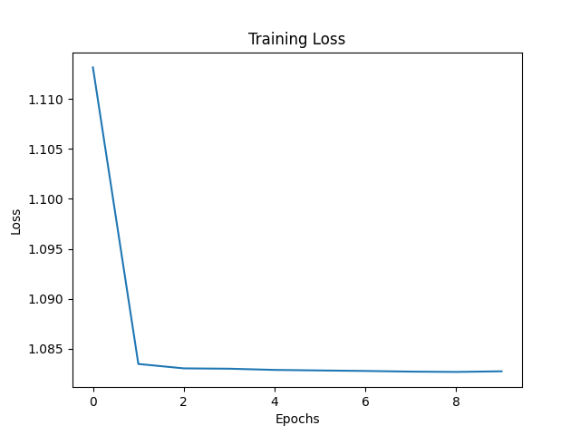
  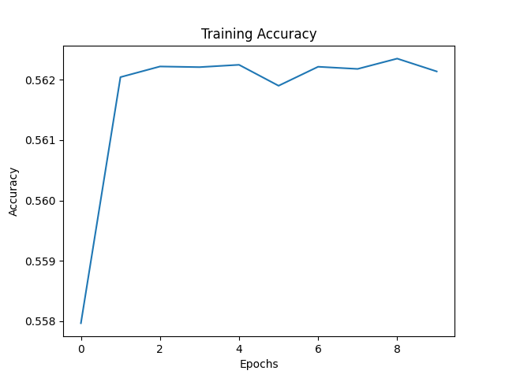
</div>

seed 42
<div style="display: flex; justify-content: space-between; align-items: center;">
  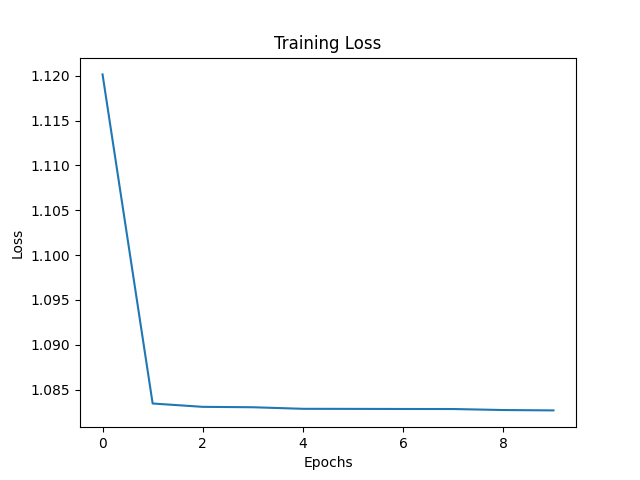
  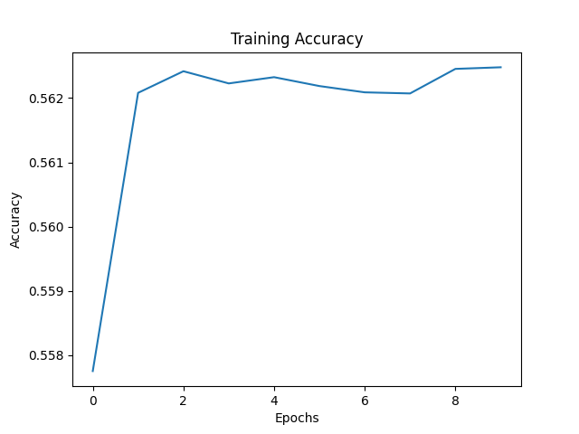
</div>

seed 100
<div style="display: flex; justify-content: space-between; align-items: center;">
  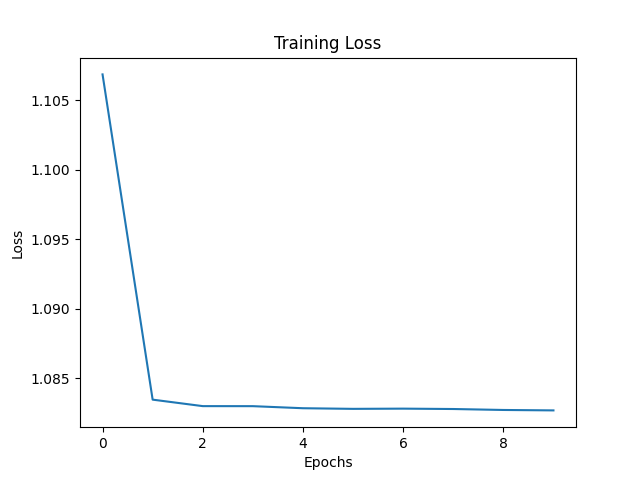
  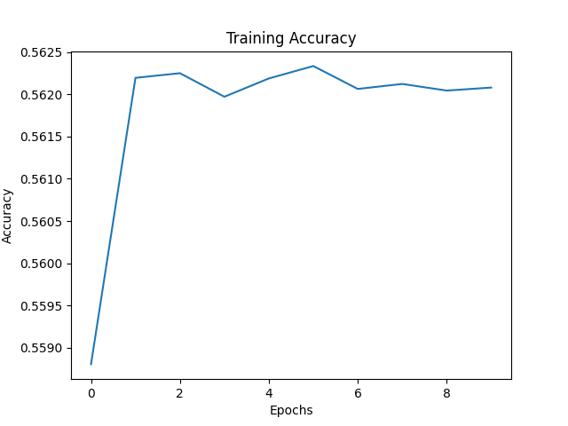
</div>

### multiplicative LSTM
seed 0
<div style="display: flex; justify-content: space-between; align-items: center;">
  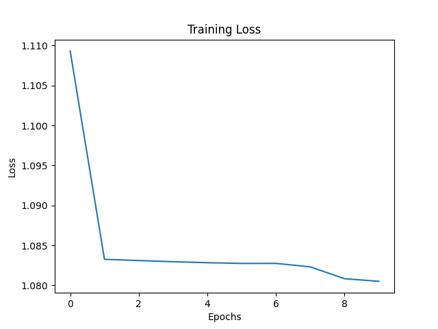
  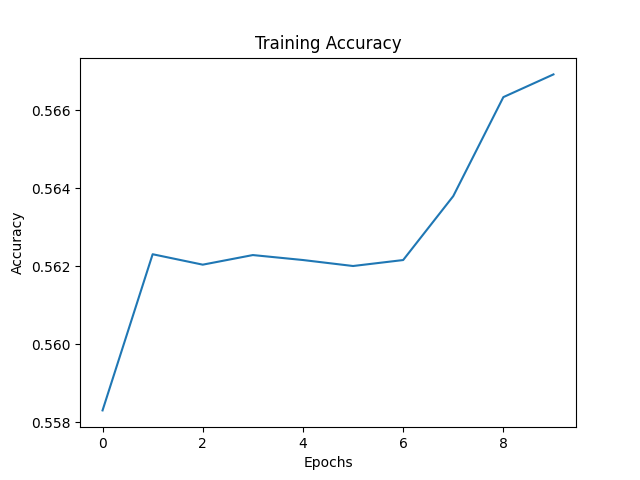
</div>

seed 42
<div style="display: flex; justify-content: space-between; align-items: center;">
  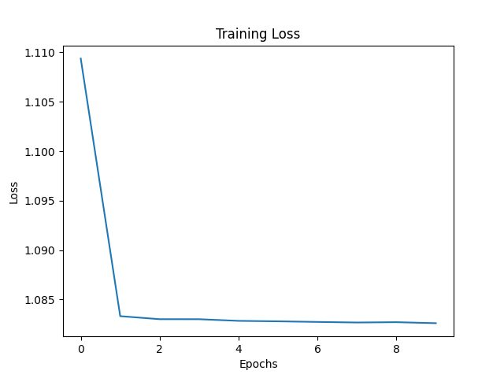
  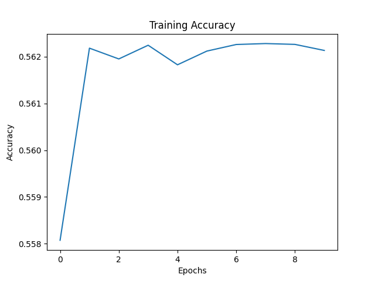
</div>

seed 100
<div style="display: flex; justify-content: space-between; align-items: center;">
  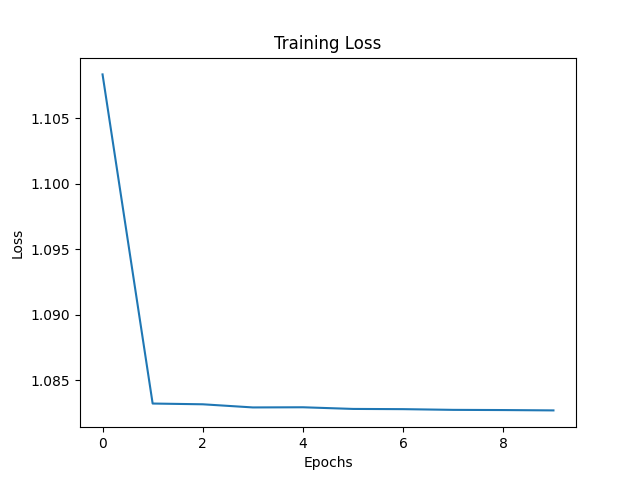
  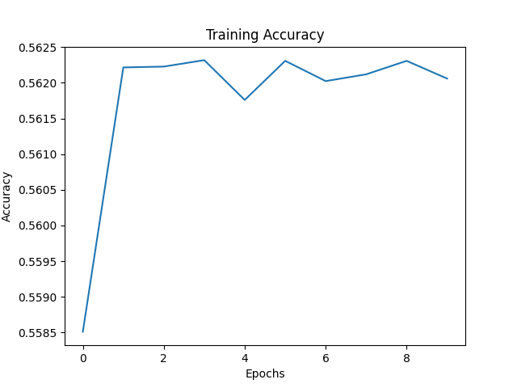
</div>

### GRU
seed 0
<div style="display: flex; justify-content: space-between; align-items: center;">
  
  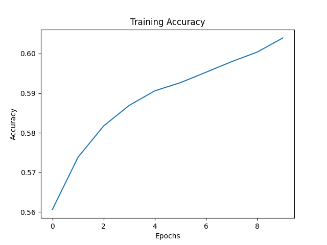
</div>

seed 42
<div style="display: flex; justify-content: space-between; align-items: center;">
  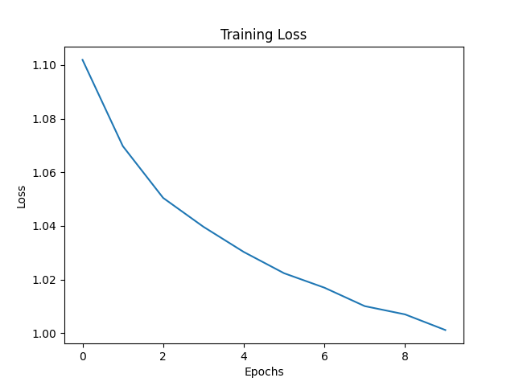
  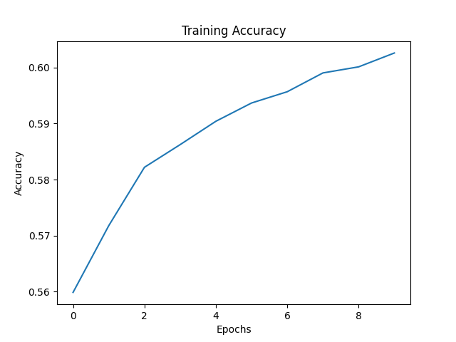
</div>

seed 100
<div style="display: flex; justify-content: space-between; align-items: center;">
  
  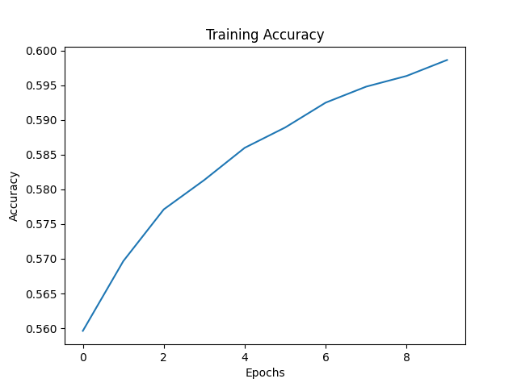
</div>

### multiplicative GRU
seed 0
<div style="display: flex; justify-content: space-between; align-items: center;">
  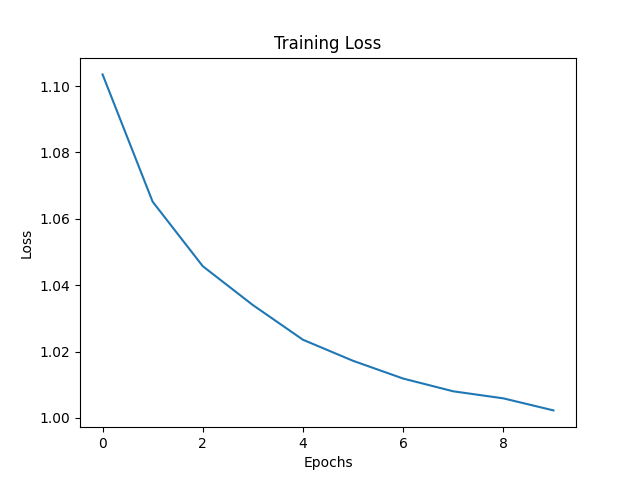
  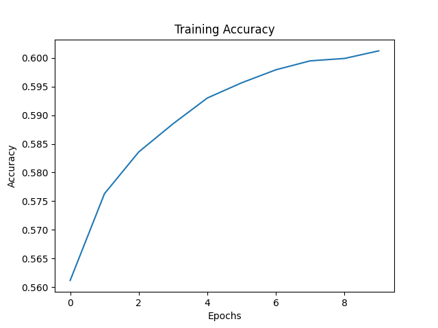
</div>

seed 42
<div style="display: flex; justify-content: space-between; align-items: center;">
  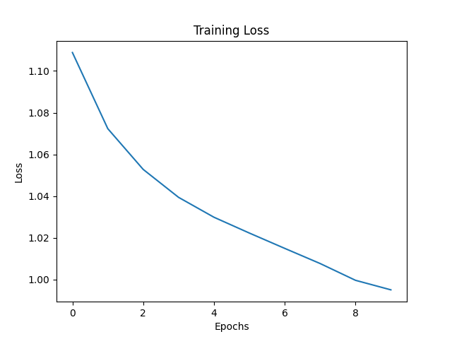
  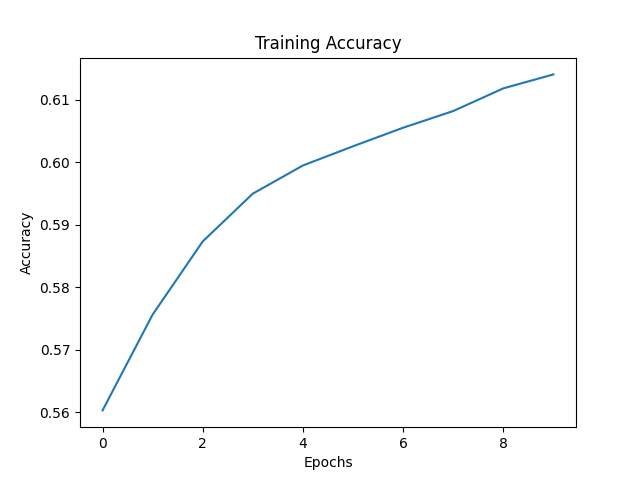
</div>

seed 100
<div style="display: flex; justify-content: space-between; align-items: center;">
  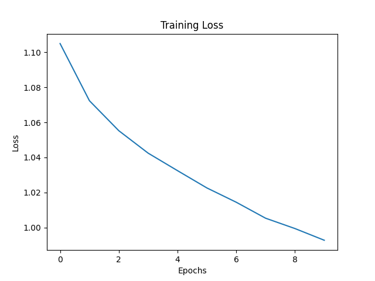
  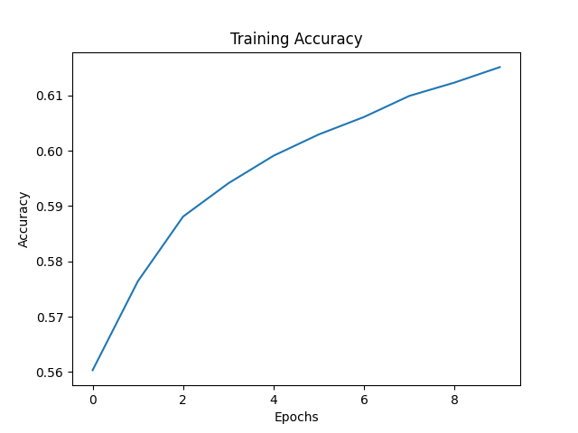
</div>